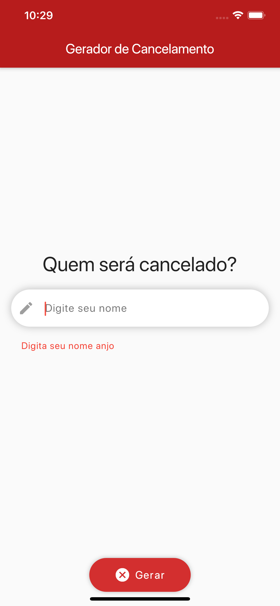
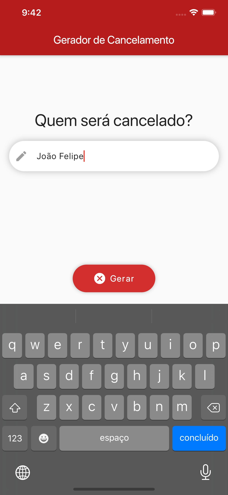

  

# CancelAPP

Um projeto Flutter para criar um gerador de Cancelamento

## Built With
* [Flutter](http://flutter.dev/) - UI toolkit (Core)
* [MobX](https://https://pub.dev/packages/mobx/) - State Management
* [Provider](https://https://pub.dev/packages/provider/) - Dependency Injector

## Screenshots

  
   
  

## Supported Platforms
| Platforms| Suported |
| ------------- | ---------|
| Android| ✅|
| iOS| ✅|
| Web| ✅|
